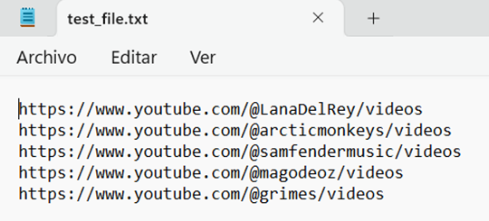
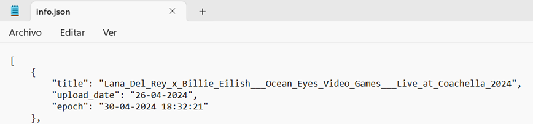
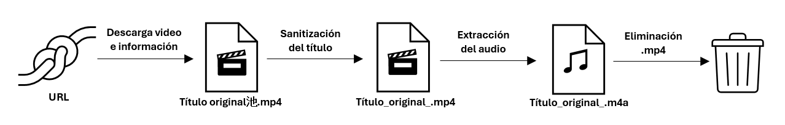
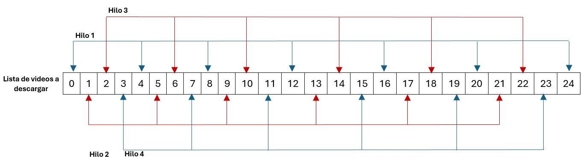

# Infraestructuras Paralelas y Distribuidas - 750023C 01
## Parcial I - Parte práctica

### Autores:
- [Samuel Galindo Cuevas](https://github.com/SakyJoestar) - 2177491
- [Nicolás Herrera Marulanda](https://github.com/Herreran903) - 2182551
- [Christian David Vargas Gutiérrez](https://github.com/ChristianV2426/)- 2179172

### Profesor:
John Sanabria PhD

**El código fuente del programa se encuentra alojado en el siguiente [repositorio de Github.](https://github.com/ChristianV2426/Parcial-I-Infraestructuras)**

## REQUERIMEINTOS Y ESPECIFICACIONES

Para que la aplicación funcione correctamente, es necesario que la máquina en la que se ejecute tenga instalado:
- Python versión 3.8 o superior
- yt-dlp versión 2024.04.04 o superior
- ffmpeg versión 7.0 o superior

El archivo de entrada del programa debe ser un archivo de texto .txt que contenga 5 líneas, cada una con la URL de un canal de YouTube. Por ejemplo:

Los archivos de salida serán los audios de los 5 últimos vídeos de cada canal, guardados en la carpeta especificada en la ruta de descarga. Además, se creará un archivo info.json con la información de los vídeos descargados (título, fecha de subida a YouTube y fecha de descarga del vídeo). Por ejemplo:

## EJECUCIÓN DEL PROGRAMA

Para ejecutar el programa, se debe abrir una terminal desde la misma ubicación en la que se encuentra el archivo main.py y ejecutar el siguiente comando, con los argumentos y banderas en orden estricto:

**python3 main.py** ***<ruta_archivo_entrada>*** ***<ruta_descarga>***                                             opcional: ***<modo_ejecución>*** ***<número_hilos o número_procesos>***

Donde:

•	***<ruta_archivo_entrada>*** es la ruta del archivo .txt que contiene las URLs de los 5 canales de YouTube de los que se desean descargar los últimos 5 vídeos.

•	***<ruta_descarga>*** es la ruta en la que se guardarán los vídeos descargados. El programa creará una carpeta a este nivel con el nombre de /audio_extraction_at_<fecha_descarga>.

•	***<modo_ejecución>*** es el modo en el que se desea ejecutar el programa. Puede ser "-t" (multithreading) o "-p" (multiprocessing). Si no se especifica, se ejecutará en modo secuencial.

•	***<número_hilos o número_procesos>*** si se especifica el <modo_ejecucion>, se debe indicar el número de hilos o procesos a utilizar.

## FUNCIONAMIENTO DEL PROGRAMA

El script que define las tareas que realiza cada trabajador (hilo o proceso) se encuentra en la función script dentro del paquete modules.script.

1.	En este script lo primero que se hace es utilizar yt-dlp para descargar el video pasado como argumento, en formato mp4. Adicionalmente, en una lista compartida por todos los hilos o procesos se guara un objeto json de Python toda la información relacionada al vídeo (título, fecha de subida a Youtube y fecha de descarga local).

2.	A continuación se realiza una sanitización del título del archivo mp4, para evitar espacios y caracteres que después le impidan al sistema operativo encontrar el archivo. 

3.	El siguiente paso involucra la extracción del audio desde el archivo de vídeo utilizando ffmpeg. El audio se guarda en un archivo con el mismo título pero con extensión m4a.

4.	Como última etapa, se elimina el video .mp4 del fichero de descarga.

Una vez todos los trabajadores han terminado de ejecutar el script para los vídeos que se le asignan, entonces el hilo principal (main) traslada la información guardada en la lista de json (paso 1) a un archivo local info.jso. Finalmente, se imprime en consola un mensaje anunciando la terminación del programa y las métricas de tiempo obtenidas.
La asignación de responsabilidades a cada trabajador se programó utilizando ciclos for. Por ejemplo, para la ejecución paralela con 4 hilos, el hilo 1 está encargado de ejecutar el script para los videos en la posición 0, 4, 8, 12, 16, 20 y 24 de la lista de videos a descargar (imagen 4).

## Tiempos de ejecución y análisis del paralelismo logrado
[Informe](Informe.pdf)